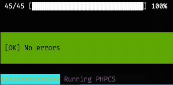

# Magento 2 Catalog Generator Module

This is a Magento 2 module for generating catalogs efficiently based on YAML configuration files. It supports the creation of categories, products, customer groups, websites, and more, directly using SQL queries for improved performance.

---

## Installation

1. Install the module using `composer`

   ```bash
   composer require qoliber/m2-catalog-generator
   ```

2. Run the following commands to enable the module and clear cache:

   ```bash
   php bin/magento module:enable Qoliber_CatalogGenerator
   php bin/magento setup:upgrade
   php bin/magento cache:flush
   ```
   
## How to use: 

### Command Usage

To generate a catalog, use the following console command:

   ```bash
   php bin/magento qoliber:catalog:generate [file.yml]
   ```

### Important information

**Entire product catalog and related tables are completely wiped out of all testing / live data.**
**You can view `CleanUp` class in `Sql` directory

Replace `[file.yml]` with the path to your YAML configuration file. 
Sample configurations can be found in the `_samples` directory (`small.yml`, `medium.yml`, and `large.yml`).

Example:

   ```bash
   php bin/magento qoliber:catalog:generate app/code/Qoliber/CatalogGenerator/_samples/small.yml
   ```

## Module Features

* Flexible Configuration: Define catalogs using YAML configuration files.
* Optimized Performance: Leverages direct SQL queries for faster data population.
* Modular Architecture: Easily extendable and well-organized codebase.
* Customizable Entities:
  * Products (Simple, Configurable, Bundle, Grouped)
  * Categories
  * Websites
  * Store Views
* Attribute Handling: Populates and combines configurable attributes efficiently.
* Attribute Handling: Populates and combines configurable attributes efficiently.
* Creating randomized product images
* Product

## Module Structure

Below is an overview of the module’s directory structure:

### Key Components

* Api: Defines interfaces for extensibility and loose coupling.
* Config: Handles configuration parsing and validation.
* Console: Contains `CLI` commands to trigger catalog generation.
* Data: Implements data generation and population logic.
* Generators: Logic for creating entities (e.g. products, categories).
* Populators: Populates entity attributes.
* Reader: Reads `YAML` configuration files.
* Resolver: Resolves entity names and dependencies.
* Service: Orchestrates catalog generation and cleanup.
* Sql: Handles raw `SQL` operations for optimal performance.
* Task: Executes specific tasks like assigning products to categories and generating URLs.

### Sample YAML Files

Example YAML files are available in the _samples directory:
* `small.yml`: Minimal configuration for quick testing.
* `medium.yml`: Moderate configuration for medium-sized catalogs.
* `large.yml`: Comprehensive configuration for large catalogs.
 
## Developer Notes

* `Dependency Injection`: The module follows Magento’s DI pattern for better flexibility
* `Testing`: Unit tests are available under `Test/Unit`.
* Code is passing `phpstan-8` and `phpcs magento-coding-standards`


  

### Example Classes:

* Generators: Found in Data/Generators, these create catalog entities.
* Populators: Found in Data/Populators, these populate attributes for entities.
* Tasks: Found in Task, these handle specific catalog operations.

## License

This module is open-source and distributed under the MIT License.

---

For further questions or contributions, feel free to contact us or submit a pull request!
